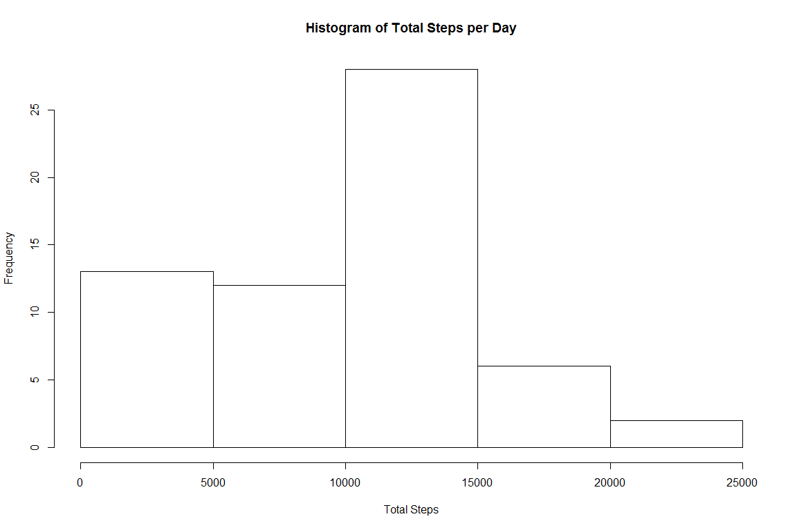
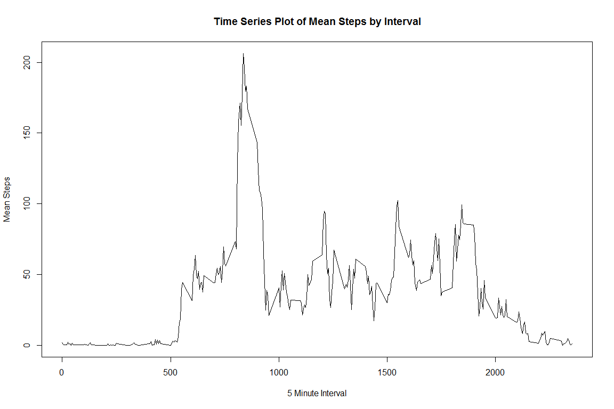
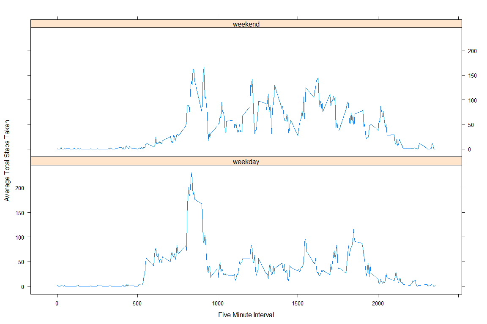

## Loading necessary libraries

```r
suppressPackageStartupMessages(library(dplyr))
suppressPackageStartupMessages(library(lattice))
```

## Display figure information

```r
knitr::opts_chunk$set(fig.width=12, fig.height=8, fig.path='Figs/',
                      echo=TRUE, warning=FALSE, message=FALSE)
```

## Loading and preprocessing the data

```r
unzip("activity.zip")
dat<-read.csv("activity.csv",header=TRUE)


totalsteps<- dat %>% group_by(date) %>% summarize(steps=sum(steps, na.rm=TRUE))

hist(totalsteps$steps, main="Histogram of Total Steps per Day", xlab="Total Steps")
```

<!-- -->


## What is mean total number of steps taken per day?

```r
meansteps1<-mean(totalsteps$steps)
mediansteps1<-median(totalsteps$steps)
```

The mean total steps per day is 9354.2295082, and the mediean total steps per day is 10395.

## What is the average daily activity pattern?

```r
interval<- dat %>% group_by(interval) %>% summarize(meansteps=mean(steps, na.rm=TRUE))
plot(interval$interval, interval$meansteps, type="l", main="Time Series Plot of Mean Steps by Interval", xlab="5 Minute Interval", ylab="Mean Steps")
```

<!-- -->

```r
maxsteps<-interval[which.max(interval$meansteps),]
```

The maximum average steps of 206.1698113 occur during interval 835.


## Imputing missing values

```r
NAvalues<-sum(is.na(dat$steps))
```
The total number of observations missing steps is 2304.

The mean steps for that interval was used to fill in the missing values. To do this, I joined the mean steps per interval to the main data frame, and substituting the mean steps per interval into the missing value using a subset function. 

```r
meansteps<-dat %>% group_by(interval) %>% summarize(meansteps=mean(steps, na.rm=TRUE))
datfill<-right_join(dat,meansteps)
datfill$steps[is.na(datfill$steps)]<-datfill$meansteps[is.na(datfill$steps)]
totalsteps<- datfill %>% group_by(date) %>% summarize(steps=sum(steps, na.rm=TRUE))
hist(totalsteps$steps, main="Histogram of Total Steps per Day", xlab="Total Steps")
```

<!-- -->

```r
meansteps2<-mean(totalsteps$steps)
mediansteps2<-median(totalsteps$steps)
meandiff<-meansteps2-meansteps1
mediandiff<-mediansteps2-mediansteps1
```
The mean total number of steps is 1.0766189\times 10^{4} and the median total number of steps is 1.0766189\times 10^{4}. The difference between the mean steps is 1411.959171. The difference between the median steps is 371.1886792.


## Are there differences in activity patterns between weekdays and weekends?

```r
datfill<- datfill %>% transform(date=as.character(date))
datfill<- datfill %>% transform(date=as.character(date)) %>% transform(date=strptime(date,"%Y-%m-%d")) %>% transform(date=as.POSIXct(date))

datfill <- datfill %>% mutate(daytype=as.factor(ifelse(weekdays(datfill$date) %in% c("Saturday","Sunday"),"weekend","weekday")))

avgtypeint<-datfill %>% group_by(interval,daytype) %>% summarize(mean(steps))

names(avgtypeint)<-c("interval","daytype","avgsteps")

xyplot(avgsteps ~ interval|daytype, data=avgtypeint,layout=c(1,2),type="l",xlab="Five Minute Interval",ylab="Average Total Steps Taken")
```

<!-- -->
